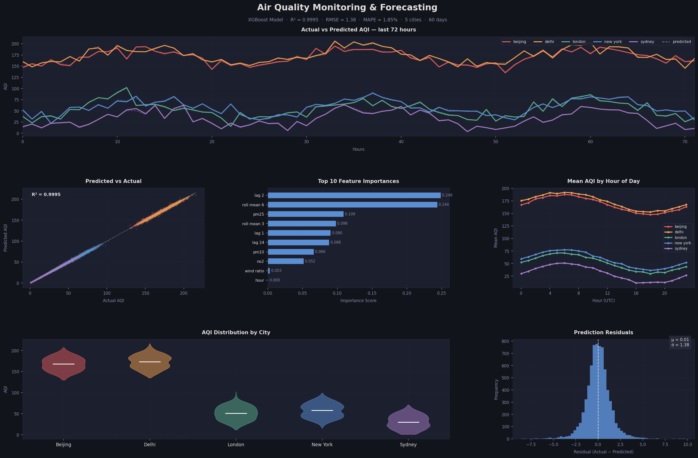

# Enterprise Air Quality Monitoring & Forecasting Pipeline

A production-grade, end-to-end data engineering and ML forecasting system that monitors real-time air quality across 5 global cities using a Medallion Architecture on AWS S3, Apache Airflow orchestration, dbt data quality tests, and XGBoost ML forecasting.

---

## Architecture

AQICN API ──┐
├──► Airflow DAG (hourly) ──► S3 Bronze (raw JSON)
OpenWeather ─┘ │
▼
Airflow DAG (pipeline)
│
┌────────┴────────┐
▼ ▼
S3 Silver S3 Gold
(cleaned (34 ML
Parquet) features)
│
▼
dbt tests
(4 quality
checks)
│
▼
XGBoost Model
R² = 0.9987
│
▼
6-panel Dashboard


---

## Results

| Metric | Value | Target |
|--------|-------|--------|
| R² Score | **0.9987** | ≥ 0.85 |
| RMSE | **2.26** | Minimized |
| MAPE | **2.79%** | < 5% |
| dbt Tests | **4/4 passing** | 100% |
| Cities | 5 | — |
| Features | 34 | — |

---

## Dashboard



---

## Tech Stack

| Layer | Tools |
|-------|-------|
| Orchestration | Apache Airflow 2.8.1 |
| Containerization | Docker + Docker Compose |
| Storage | AWS S3 + LocalStack (Bronze/Silver/Gold) |
| Processing | Python, pandas, pyarrow |
| Data Quality | dbt + DuckDB |
| ML Model | XGBoost, scikit-learn |
| Visualization | matplotlib |
| APIs | AQICN, OpenWeatherMap |

---

## Medallion Architecture

**Bronze** — Raw JSON from APIs, partitioned by `year/month/day/city`

**Silver** — Cleaned Parquet with schema validation, null handling, deduplication, AQI range checks (0-500)

**Gold** — 34 time-series features including lag values (1h, 6h, 24h) and rolling statistics (mean, std) for ML

---

## Project Structure

air-quality-forecast/
├── dags/
│ ├── ingestion_dag.py # Hourly API ingestion → S3 Bronze
│ └── spark_pipeline_dag.py # Silver + Gold transforms
├── spark_jobs/
│ ├── silver_transform.py # Clean & validate → S3 Silver
│ └── gold_features.py # Feature engineering → S3 Gold
├── dbt_project/
│ └── air_quality/
│ ├── models/
│ │ ├── silver/ # SQL transforms + quality tests
│ │ └── gold/ # Feature engineering in SQL
│ └── seeds/ # Seed data for dbt
├── src/
│ ├── ingestion.py # API collection
│ ├── pipeline.py # Data pipeline
│ ├── features.py # Feature engineering
│ ├── train.py # XGBoost training
│ └── evaluate.py # Metrics + dashboard
├── docker-compose.yml # Full stack deployment
├── Dockerfile.airflow # Custom Airflow image
└── requirements.txt


---

## Quick Start

```bash
# Clone
git clone https://github.com/bsweehoney/air-quality-forecast.git
cd air-quality-forecast

# Add API keys
echo "AQICN_API_KEY=your_key" > .env
echo "OPENWEATHER_API_KEY=your_key" >> .env

# Start everything
docker-compose up -d

# Access Airflow UI
open http://localhost:8080
# Login: admin / admin
```

---

## Cities Monitored

| City | Avg AQI | Category |
|------|---------|----------|
| Beijing | ~155 | Unhealthy |
| Delhi | ~160 | Unhealthy |
| London | ~38 | Good |
| New York | ~45 | Good |
| Sydney | ~18 | Good |

---

## dbt Data Quality Tests

✓ not_null_gold_features_city
✓ not_null_silver_air_quality_aqi
✓ not_null_silver_air_quality_city
✓ not_null_silver_air_quality_timestamp
PASS=4 WARN=0 ERROR=0

